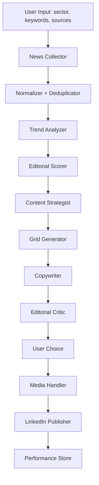

# CLAUDE.md
## Agente de Curaduría y Publicación para LinkedIn

Este documento define la arquitectura, principios, flujo operativo y contratos de implementación para un agente desarrollado en Claude Code que detecta noticias relevantes de un sector, propone una grilla editorial, redacta múltiples borradores de publicación y publica en LinkedIn con aprobación explícita del usuario.

---

## 1. Objetivo del sistema

Construir un agente que:

1. Reciba un sector, tema o conjunto de fuentes objetivo.
2. Monitoree noticias relevantes y detecte señales de alto valor editorial.
3. Filtre, agrupe y priorice noticias para evitar ruido y duplicación.
4. Genere una grilla de opciones de contenido para LinkedIn.
5. Redacte 3 borradores de post por noticia priorizada.
6. Presente las opciones al usuario para selección.
7. Pregunte cuál publicar.
8. Publique inmediatamente en LinkedIn tras confirmación del usuario.
9. Soporte publicaciones con texto, imagen, PDF o video.
10. Registre resultados para mejorar futuras recomendaciones.

---

## 2. Principios de diseño

### 2.1 No automatizar sin criterio
El valor del sistema no está en publicar mucho, sino en seleccionar qué merece ser publicado.

### 2.2 No resumir noticias
El agente no debe limitarse a resumir. Debe transformar noticias en posicionamiento, interpretación y señal intelectual.

### 2.3 Separar funciones
Discovery, ranking, redacción, evaluación y publicación son módulos distintos.

### 2.4 Human-in-the-loop
La publicación final requiere confirmación explícita del usuario. No se publica automáticamente sin elección final.

### 2.5 Trazabilidad
Cada post debe poder rastrearse hacia:
- noticia original
- razón de priorización
- ángulo editorial
- borrador elegido
- resultado obtenido

### 2.6 Aprendizaje iterativo
El sistema debe guardar desempeño para refinar:
- tipos de hooks
- formatos
- temas
- tono
- longitudes
- assets

---

## 3. Alcance funcional

### Entrada del usuario
- sector o industria
- keywords
- lista de fuentes
- idioma
- objetivo editorial
- frecuencia deseada
- estilo de comunicación
- preferencia de formatos (texto, imagen, PDF, video)

### Salidas esperadas
- ranking de noticias detectadas
- grilla de opciones editoriales
- 3 borradores por pieza
- recomendación de mejor opción
- publicación en LinkedIn
- registro de performance

---

## 4. Arquitectura general



---

## 5. Módulos del sistema

### 5.1 `NewsCollector`
Responsabilidad:
- consultar RSS, APIs de noticias, fuentes específicas, blogs sectoriales y sitios definidos por el usuario

Funciones:
- `fetchFromRSS()`
- `fetchFromNewsAPI()`
- `fetchFromCustomSources()`
- `collect()`

Output:
```ts
type RawNewsItem = {
  id?: string
  source: string
  title: string
  url: string
  summary?: string
  publishedAt: string
  author?: string
  imageUrl?: string
  tags?: string[]
  rawText?: string
}
```

---

### 5.2 `NewsNormalizer`
Responsabilidad:
- limpiar ruido
- unificar campos
- normalizar fechas, fuentes y entidades

Funciones:
- `normalize(rawItem)`
- `normalizeBatch(items)`

Output:
```ts
type NormalizedNewsItem = {
  id: string
  source: string
  title: string
  url: string
  summary: string
  publishedAt: string
  canonicalText: string
  entities: string[]
  themes: string[]
  imageUrl?: string
}
```

---

### 5.3 `Deduplicator`
Responsabilidad:
- evitar que varias coberturas de la misma noticia entren como piezas distintas

Técnicas:
- hash semántico
- cosine similarity de embeddings
- heurísticas por título + entidad + fecha

Funciones:
- `clusterDuplicates(items)`
- `selectCanonicalItem(cluster)`

---

### 5.4 `TrendAnalyzer`
Responsabilidad:
- detectar qué noticias tienen mayor potencial de conversación

Señales sugeridas:
- recencia
- cantidad de fuentes cubriendo el tema
- autoridad de la fuente
- relevancia con el sector definido
- novedad semántica
- presencia de empresas/personas clave

Funciones:
- `scoreTrend(item)`
- `rank(items)`

Output:
```ts
type RankedNewsItem = NormalizedNewsItem & {
  recencyScore: number
  sourceAuthorityScore: number
  relevanceScore: number
  noveltyScore: number
  discussionPotentialScore: number
  finalScore: number
}
```

---

### 5.5 `EditorialScorer`
Responsabilidad:
- responder: "¿vale la pena convertir esta noticia en un post?"

Criterios:
- capacidad de generar opinión
- conexión con la audiencia
- posibilidad de contraste
- oportunidad de posicionamiento
- riesgo reputacional

Funciones:
- `scoreEditorialValue(item, userProfile)`
- `filterLowSignal(items)`

Output:
```ts
type EditorialDecision = {
  publishWorthy: boolean
  rationale: string
  contentAngles: string[]
  riskFlags: string[]
}
```

---

### 5.6 `ContentStrategist`
Responsabilidad:
- convertir noticia en tesis comunicable

Debe generar:
- ángulo analítico
- ángulo provocador
- ángulo práctico

Ejemplos de ángulos:
- "qué cambia estratégicamente"
- "qué está mal interpretando el mercado"
- "qué deberían hacer los operadores del sector"
- "por qué esta noticia importa más de lo que parece"

Funciones:
- `generateAngles(item, userContext)`
- `selectTopAngles(item)`

Output:
```ts
type ContentAngle = {
  angleId: string
  title: string
  thesis: string
  audienceFit: string
  whyNow: string
}
```

---

### 5.7 `GridGenerator`
Responsabilidad:
- producir una grilla editorial visible para selección

Cada fila incluye:
- noticia
- ángulo
- prioridad
- formato sugerido
- hipótesis de engagement

Output:
```ts
type GridOption = {
  optionId: string
  newsId: string
  headline: string
  angle: string
  format: "text" | "image" | "pdf" | "video"
  estimatedEngagement: number
  estimatedAuthorityLift: number
  reason: string
}
```

---

### 5.8 `Copywriter`
Responsabilidad:
- generar 3 borradores por opción

Cada borrador debe variar en:
- hook
- estructura argumental
- nivel de contundencia
- CTA final

Reglas:
- no resumir
- no sonar genérico
- no usar clichés de IA
- escribir para crecer comunidad sin sacrificar densidad

Formato recomendado:
1. Hook
2. Desarrollo
3. Insight
4. Cierre con pregunta o tensión abierta

Funciones:
- `generateDrafts(option, count = 3)`

Output:
```ts
type DraftPost = {
  draftId: string
  optionId: string
  variant: 1 | 2 | 3
  hook: string
  body: string
  closing: string
  fullText: string
  hashtags?: string[]
}
```

---

### 5.9 `EditorialCritic`
Responsabilidad:
- evaluar la calidad de los borradores antes de mostrarlos

Criterios:
- claridad
- originalidad
- densidad de insight
- potencial de comentarios
- potencial de guardado
- coherencia con voz del autor

Funciones:
- `evaluateDraft(draft)`
- `rankDrafts(drafts)`

Output:
```ts
type DraftEvaluation = {
  draftId: string
  originality: number
  clarity: number
  authority: number
  engagementPotential: number
  savePotential: number
  totalScore: number
  strengths: string[]
  weaknesses: string[]
}
```

Regla sugerida:
- si `totalScore < 32/50`, regenerar

---

### 5.10 `MediaHandler`
Responsabilidad:
- preparar assets para la publicación

Tipos soportados:
- imagen
- PDF
- video

Funciones:
- `prepareImageAsset(pathOrUrl)`
- `preparePdfAsset(pathOrUrl)`
- `prepareVideoAsset(pathOrUrl)`
- `registerUpload(linkedinType)`
- `uploadAsset()`
- `resolveMediaCategory()`

Observación:
LinkedIn tiene flujos distintos según media type. No asumir que todos comparten el mismo endpoint o proceso.

---

### 5.11 `LinkedInPublisher`
Responsabilidad:
- publicar el post en LinkedIn

Funciones:
- `createTextPost()`
- `createImagePost()`
- `createDocumentPost()`
- `createVideoPost()`
- `publish(selectedDraft, selectedMedia?)`

Precondiciones:
- token válido
- permisos concedidos
- author URN resuelto
- asset subido si existe media

---

### 5.12 `PerformanceStore`
Responsabilidad:
- guardar historial y resultados

Guardar:
- noticia seleccionada
- draft elegido
- formato
- timestamp
- sector
- métricas posteriores

Métricas mínimas:
- impresiones
- likes
- comentarios
- reposts
- CTR si existe
- guardados si pueden inferirse o capturarse indirectamente

Funciones:
- `savePublishedPost()`
- `savePostMetrics()`
- `getHistoricalPerformance()`
- `getTopPatterns()`

---

## 6. Flujo operativo completo

### Paso 1. Definir foco
El usuario define:
- sector
- subtemas
- fuentes
- tono
- objetivo del contenido

### Paso 2. Recolectar noticias
El sistema extrae noticias recientes.

### Paso 3. Normalizar y deduplicar
Se eliminan duplicados y se agrupan coberturas repetidas.

### Paso 4. Rankear
Se priorizan noticias con potencial editorial.

### Paso 5. Generar grilla
Se construye una lista corta de oportunidades de publicación.

### Paso 6. Redactar 3 borradores
Para cada opción priorizada, se generan 3 versiones.

### Paso 7. Evaluar calidad
Se puntúan y ordenan las versiones.

### Paso 8. Preguntar al usuario
El agente presenta opciones y pregunta:
- cuál noticia
- cuál borrador
- si desea adjuntar media

### Paso 9. Publicar
Tras confirmación explícita:
- subir asset si aplica
- publicar en LinkedIn

### Paso 10. Aprender
Se registran resultados y preferencias.

---

## 7. Interfaz conversacional esperada

### Ejemplo de respuesta del agente
1. "Encontré 5 noticias con alto valor editorial en tu sector."
2. "Estas son las 3 mejores para LinkedIn."
3. "Para la opción 1, preparé 3 borradores."
4. "Mi recomendación es el borrador 2 por mayor potencial de comentarios."
5. "¿Cuál quieres publicar?"

### Ejemplo de confirmación de publicación
- "Elige opción A, borrador 2, con imagen 1."
- "Publica ahora."

### Regla crítica
Nunca publicar si el usuario no confirmó la opción final.

---

## 8. Contratos de datos recomendados

```ts
type UserContentProfile = {
  sectors: string[]
  keywords: string[]
  preferredTone: "analytical" | "provocative" | "practical" | "executive"
  targetAudience: string
  publishingGoal: "community_growth" | "authority" | "lead_gen" | "brand"
  preferredFormats: ("text" | "image" | "pdf" | "video")[]
}

type PublishRequest = {
  draftId: string
  mediaType?: "image" | "pdf" | "video"
  mediaPath?: string
  publishNow: boolean
}
```

---

## 9. Estructura de carpetas sugerida

```txt
linkedin-agent/
├── src/
│   ├── agents/
│   │   ├── newsCollector.ts
│   │   ├── newsNormalizer.ts
│   │   ├── deduplicator.ts
│   │   ├── trendAnalyzer.ts
│   │   ├── editorialScorer.ts
│   │   ├── contentStrategist.ts
│   │   ├── gridGenerator.ts
│   │   ├── copywriter.ts
│   │   ├── editorialCritic.ts
│   │   ├── mediaHandler.ts
│   │   └── linkedinPublisher.ts
│   │
│   ├── prompts/
│   │   ├── strategist.md
│   │   ├── copywriter.md
│   │   ├── critic.md
│   │
│   ├── services/
│   │   ├── linkedinApi.ts
│   │   ├── rssService.ts
│   │   ├── newsApiService.ts
│   │   ├── embeddingService.ts
│   │   └── llmService.ts
│   │
│   ├── storage/
│   │   ├── performanceStore.ts
│   │   └── db.ts
│   │
│   ├── types/
│   │   └── index.ts
│   │
│   ├── config/
│   │   └── env.ts
│   │
│   └── main.ts
│
├── .env
├── package.json
├── tsconfig.json
└── CLAUDE.md
```

---

## 10. Orquestador principal

Pseudo-código:

```ts
async function runLinkedInContentAgent(input: UserContentProfile) {
  const rawNews = await NewsCollector.collect(input)
  const normalized = await NewsNormalizer.normalizeBatch(rawNews)
  const deduped = await Deduplicator.clusterAndSelect(normalized)
  const ranked = await TrendAnalyzer.rank(deduped)
  const publishable = await EditorialScorer.filterLowSignal(ranked)
  const grid = await GridGenerator.build(publishable, input)

  const selectedGridOptions = grid.slice(0, 3)

  const draftsByOption = await Promise.all(
    selectedGridOptions.map(option => Copywriter.generateDrafts(option, 3))
  )

  const evaluations = await Promise.all(
    draftsByOption.flat().map(draft => EditorialCritic.evaluateDraft(draft))
  )

  return {
    grid: selectedGridOptions,
    drafts: draftsByOption,
    evaluations
  }
}
```

---

## 11. Prompt estratégico recomendado

### `prompts/strategist.md`

```md
Actúa como estratega editorial senior para LinkedIn.

Tu tarea no es resumir noticias, sino convertirlas en posicionamiento intelectual.

Para cada noticia:
1. Identifica por qué importa realmente.
2. Detecta qué está subestimando o malinterpretando el mercado.
3. Propón 3 ángulos:
   - analítico
   - provocador
   - práctico
4. Prioriza el ángulo que mejor combine autoridad, claridad y conversación.

Evita:
- repetir el titular
- resumir el artículo
- frases vacías
- entusiasmo superficial
```

---

## 12. Prompt de redacción recomendado

### `prompts/copywriter.md`

```md
Actúa como un redactor top 1% de LinkedIn.

Objetivo:
crear publicaciones que aumenten autoridad y comunidad.

Input:
- noticia
- tesis editorial
- audiencia
- tono
- objetivo de crecimiento

Genera 3 versiones muy distintas.

Cada versión debe incluir:
1. Hook fuerte
2. Desarrollo con interpretación propia
3. Insight accionable o marco mental
4. Cierre que invite comentarios reales

Evita:
- resumir la noticia
- sonar como IA
- hashtags excesivos
- clichés de productividad o innovación
```

---

## 13. Prompt de crítica recomendado

### `prompts/critic.md`

```md
Evalúa el siguiente borrador de LinkedIn con criterios editoriales estrictos.

Puntúa de 1 a 10:
- originalidad
- claridad
- autoridad
- potencial de comentarios
- potencial de guardado

Luego indica:
- fortalezas
- debilidades
- si publicarlo, editarlo o descartarlo

No seas complaciente.
```

---

## 14. Integración con LinkedIn

### Requisitos
- App registrada en LinkedIn Developer
- OAuth 2.0
- permisos correctos
- token refrescable o flujo de renovación

### Permisos clave
- `r_liteprofile`
- `r_emailaddress` (si aplica)
- `w_member_social`

### Consideraciones
No asumir acceso abierto a todos los endpoints. La capacidad real depende del tipo de app y permisos concedidos.

### Pasos típicos para publicación
1. Resolver `author URN`
2. Si hay media:
   - registrar upload
   - subir asset
   - obtener asset URN
3. Crear post UGC / Share API compatible
4. Confirmar respuesta del endpoint
5. Persistir resultado

---

## 15. Consideraciones para media

### Imagen
Ideal para:
- gráficos simples
- quote cards
- visuales sectoriales

### PDF
Ideal para:
- carruseles exportados
- frameworks
- análisis resumidos
- mini reportes

### Video
Ideal para:
- comentario breve
- análisis frente a cámara
- clip explicando la noticia

### Regla
No añadir media por defecto. Solo si incrementa claridad, retención o diferenciación.

---

## 16. Reglas editoriales del agente

1. No publicar noticias irrelevantes solo por recencia.
2. No repetir lo que todo el mundo ya dijo.
3. No usar tono corporativo vacío.
4. No sonar optimista por defecto.
5. No generar hooks clickbait sin sustancia.
6. Priorizar interpretación sobre resumen.
7. Priorizar claridad sobre ornamentación.
8. Mantener tensión argumental.
9. Cerrar con una pregunta solo si abre conversación real.
10. Evitar automatización ciega.

---

## 17. Criterios para seleccionar una noticia

Una noticia es apta si cumple al menos 3 de estas condiciones:
- cambia reglas del sector
- afecta decisiones de negocio
- revela tendencia estructural
- contradice narrativas dominantes
- permite insight propio
- conecta con la audiencia objetivo
- tiene timing oportuno

Descartar si:
- solo es ruido
- no añade posicionamiento
- ya fue sobreexplotada
- exige contexto excesivo para funcionar en LinkedIn

---

## 18. Memoria y aprendizaje

Guardar por post:
- tema
- sector
- tipo de hook
- tono
- longitud
- formato
- hora/día de publicación
- métricas resultantes

Derivar patrones:
- mejores hooks por sector
- mejores formatos por audiencia
- mejor longitud promedio
- mejores ángulos
- peor tipo de contenido

---

## 19. Seguridad y control

### Reglas obligatorias
- nunca publicar sin confirmación
- validar assets antes de subir
- registrar errores de API
- reintentar uploads fallidos con backoff
- no duplicar publicación si la API devuelve timeout ambiguo sin verificar estado

### Logs mínimos
- request id
- selected draft id
- linkedin response id
- asset urn
- timestamps
- errores

---

## 20. MVP recomendado

### Fase 1
- input de sector
- RSS + 1 API de noticias
- ranking básico
- 3 borradores
- confirmación manual
- publicación solo texto

### Fase 2
- imágenes y PDF
- scoring editorial
- memoria de resultados

### Fase 3
- video
- feedback loop
- personalización por performance
- calendario editorial

---

## 21. Stack sugerido

- **Lenguaje:** TypeScript
- **Runtime:** Node.js
- **LLM orchestration:** Claude Code + SDK LLM elegido
- **HTTP:** Axios
- **Feeds RSS:** `rss-parser`
- **DB:** SQLite o Postgres
- **Queue opcional:** BullMQ
- **Embeddings:** proveedor externo o vector DB ligera
- **Config:** dotenv + zod

---

## 22. Dependencias sugeridas

```bash
npm install axios rss-parser zod dotenv uuid
npm install better-sqlite3
npm install pino
npm install date-fns
```

Opcionales:
```bash
npm install openai
npm install @anthropic-ai/sdk
npm install langchain
```

---

## 23. Definición de éxito

El agente funciona bien si:
- reduce ruido de noticias
- propone opciones con lógica editorial
- genera borradores distintos entre sí
- aumenta calidad percibida del contenido
- acelera la publicación sin degradar la marca
- aprende del histórico

El agente falla si:
- resume titulares
- produce posts intercambiables
- publica sin tensión ni insight
- automatiza volumen sin criterio
- no mejora con datos

---

## 24. Prompt de sistema recomendado para Claude Code

```md
Eres el arquitecto principal de un agente editorial para LinkedIn.

Tu función es construir un sistema modular que:
- detecta noticias relevantes de un sector definido por el usuario
- las rankea por valor editorial
- genera una grilla de oportunidades de contenido
- redacta 3 borradores por opción
- solicita confirmación explícita del usuario
- publica el contenido elegido en LinkedIn
- registra resultados para aprendizaje futuro

Prioridades:
1. claridad arquitectónica
2. separación de responsabilidades
3. calidad editorial
4. robustez de integración
5. trazabilidad
6. aprendizaje iterativo

Nunca reduzcas el sistema a un simple generador de copy.
```

---

## 25. Decisión arquitectónica central

Este proyecto no debe implementarse como un único prompt con herramientas.

Debe implementarse como un sistema de módulos con:
- contratos de datos claros
- scoring explícito
- validación antes de publicar
- memoria posterior

Ese es el punto de diferencia entre un demo y un agente útil.
